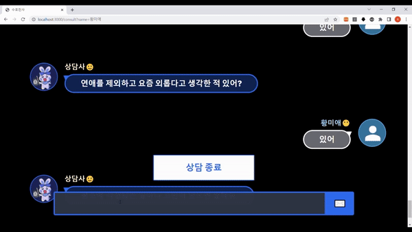

# ChatAi

- 우울증 및 학교폭력 중심의 상담 챗봇 ai
- 참여인원 4명
- 담당분야 : 인공지능
- 전체프로젝트 깃허브 : [제5회 KB국민은행 소프트웨어 경진대회 출품작 상담챗봇 협업 레포지토리 ](https://github.com/TeamGardian/AiConselor )

* * *
- 사용모델 : [KoGPT2](https://github.com/nawnoes/WellnessConversation-LanguageModel)
- 사용데이터 : [AI Hub 감성대화 말뭉치](https://aihub.or.kr/aihubdata/data/view.do?currMenu=115&topMenu=100&aihubDataSe=realm&dataSetSn=86)

## 데이터 전처리
- 전체 데이터중 연령이 청소년인 데이터만 추출
- 추출한 데이터중 상황 키워드가 대인관계,학교폭력/따돌림인 데이터를 추출

## 훈련방식
- 프리징하지않고 총 21 에포크를 훈련시킴
- [훈련코드](train.ipynb)

## 결과
- [훈련 결과](weights/README.md)
- [ 챗봇 전체 실행영상 ](https://drive.google.com/file/d/1JXRAEGrK6sQ0SzzaDDsoi_llCi5biYLW/view?usp=share_link)

### 짧은 예시 영상 

